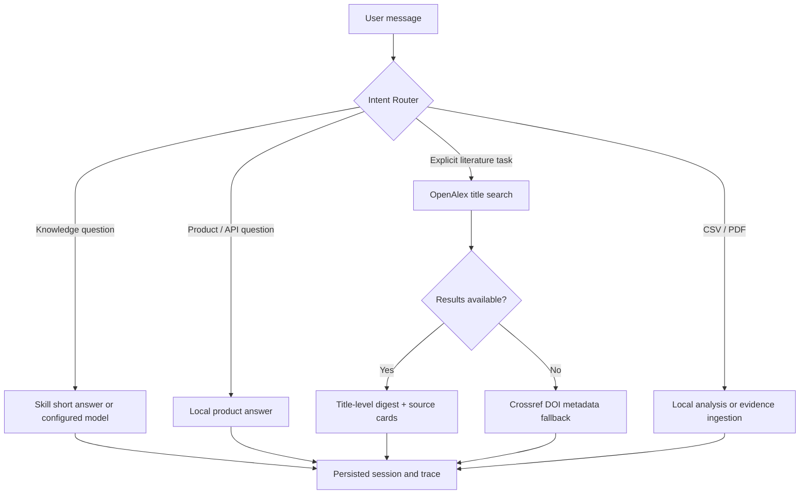

# FlexResearch Research OS architecture

FlexResearch is an evidence-first, source-connected research agent for flexible-electronics R&D. The default UI is a single conversation with embedded live research, CSV analysis and local-document ingestion. The core design decision is that an LLM is a **bounded synthesizer**, not the database of record.

```text
Question / research session
          │
          ▼
  Conductor (persistent run state)
   ├── Intent Router    → product / knowledge / literature / file-data route
   ├── Planner          → selects flexible-electronics track and evaluation checklist
   ├── Local Retriever  → SQLite FTS chunks, cited as documentId#chunkIndex
   ├── Researcher       → OpenAlex title search; Crossref fallback; Europe PMC for biomedical literature
   ├── Source Critic    → DOI / metadata / evidence-boundary checks
  └── Synthesizer      → optional OpenAI-compatible model, public metadata only
          │
          ▼
  SQLite provenance graph → session, messages, run trace, external sources, local chunks
          │
          ├── unified chat workspace (research + CSV/PDF tools embedded in-message)
          ├── Server-Sent Events execution trace (`POST /api/research/stream`)
          ├── human-reviewed protocol drafts + immutable audit events
          ├── DOI-verified material/device benchmark registry
          ├── DOI-first paper library, named reading review and BibTeX/RIS export
          ├── figure/page-anchored evidence cards with one immutable source link
          ├── decision packets: reviewed evidence cards + CSV-hash measurement snapshot + named approval
          ├── project provenance graph: explicit database and snapshot edges only
          └── Markdown evidence report
```



## Agent contract

The runtime exposes its active skill registry at `GET /api/skills`. This follows the inspectable-skill principle used by agent runtimes such as OpenClaw/Hermes: a capability names its data boundary before it is used, rather than hiding arbitrary tool calls behind one general chat prompt.

| Agent | Input | Output | Hard boundary |
| --- | --- | --- | --- |
| Intent Router | user message | product / knowledge / literature / file-data route | paper search is opt-in by intent, not a default side effect |
| Planner | research question | research track, metrics, test plan | cannot make performance claims |
| Local Retriever | question, private vault | scored text chunks and stable anchors | never sends vault text to external providers |
| Researcher | explicit literature query | OpenAlex title candidates and supplied public abstracts, Crossref fallback, Europe PMC when applicable | metadata is not a paper conclusion; no abstract is treated as no full-text summary |
| Source Critic | candidates and context | verification checklist, limitations, metadata-completeness score and flags | scores DOI/link/bibliographic completeness only; requires DOI/URL and original-paper review before citation |
| Synthesizer | question, public metadata, plan | Chinese research brief | must distinguish source fact from proposed work |

## Provenance model

External paper candidates are persisted in `research_run_sources` with source provider, DOI/title key, original URL, and the exact metadata payload used for the run. Private material is split deterministically into overlapping chunks and cited as:

```text
local:<documentId>#<chunkIndex>
```

This lets a reviewer locate the exact local evidence segment without relying on an untraceable vector-store response. The report export contains the Agent trace plus all external and local source anchors.

For PDFs, the extractor retains a form-feed boundary between physical pages. Chunking never crosses that boundary, and retrieval carries a `pageNumber` / `p. N` locator. TXT, Markdown and CSV sources retain their deterministic chunk anchor but deliberately do not receive a fabricated page number.

The literature library keeps bibliographic metadata separately from claims. A `papers` record is a discoverable and exportable reference. An `evidence_cards` record is a short, reviewable claim with one—and only one—source anchor (a paper or a local document), plus a locator such as `Fig. 3c`, `Table S2` or `p. 5`. This blocks an important failure mode: an attractive prose summary accidentally becoming a source-less fact.

`decision_packets` make this chain operational for the lab: at creation, the service copies the selected **reviewed** evidence-card claims and the selected measurement file hashes/derived metrics into `snapshot_json`. A reviewer approves or rejects the entire packet. Neither new papers nor changed measurements can alter a previous decision record; a new decision requires a new packet. This is a deliberate lightweight ledger, not a replacement for an ELN, QMS or institutional safety process.

Decision packets can also be exported as a small [RO-Crate](https://www.researchobject.org/ro-crate/specification.html)-style JSON-LD metadata record. The export describes the decision, reviewed evidence cards, DOI sources, measurement filename/hash and derived metrics without bundling private raw files or declaring a license on the laboratory's behalf.

## Data boundaries

- OpenAlex receives only an explicit literature query and is the primary title-search source.
- Crossref receives only an explicit literature query when it is needed as a DOI-centric fallback.
- Europe PMC is automatically queried only for explicit biomedical / biomimetic literature tasks and receives only the query.
- The optional compatible model receives the question, selected **public** metadata, and a planning checklist.
- Imported PDFs/SOPs/CSV documents remain in `data/uploads/` and `data/flexresearch.db`; both are Git-ignored.
- DOI imports receive public Crossref metadata only. The evidence-card workflow does not retrieve or transmit full papers on a user's behalf.

## Human approval gate

The protocol API deliberately separates generation from execution:

```text
Agent plan → protocol draft → named reviewer → approved / rejected → audit trail
```

Only a `draft` protocol can be reviewed. A reviewed protocol cannot be overwritten in place, which makes the approval event and review note stable evidence for later discussion. This is intentionally lightweight—not a substitute for institutional SOP, safety, ethics or clinical governance.

## Design references

- [PaperQA](https://github.com/Future-House/paper-qa) demonstrates scientific-literature RAG over PDFs and other documents. FlexResearch uses the same evidence-first motivation but keeps a small, inspectable SQLite implementation for lab deployment.
- [LangGraph supervisor reference](https://reference.langchain.com/python/langgraph-supervisor/supervisor) informs explicit role handoffs. FlexResearch persists its own role trace so the workflow remains inspectable without a framework lock-in.
- [OpenAlex](https://docs.openalex.org/) supplies the primary title-level discovery route; [Crossref REST API](https://www.crossref.org/documentation/retrieve-metadata/rest-api/) provides DOI-centric fallback metadata.
- [Zotero's supported import formats](https://www.zotero.org/support/adding_items_to_zotero) motivate the direct BibTeX/RIS export, so researchers are not locked into this application.

## What this is not

It is not an autonomous laboratory controller, medical device, or publication-authority system. Chemistry, biosafety, human-subject, device-operation and publication decisions require appropriate human approval.

